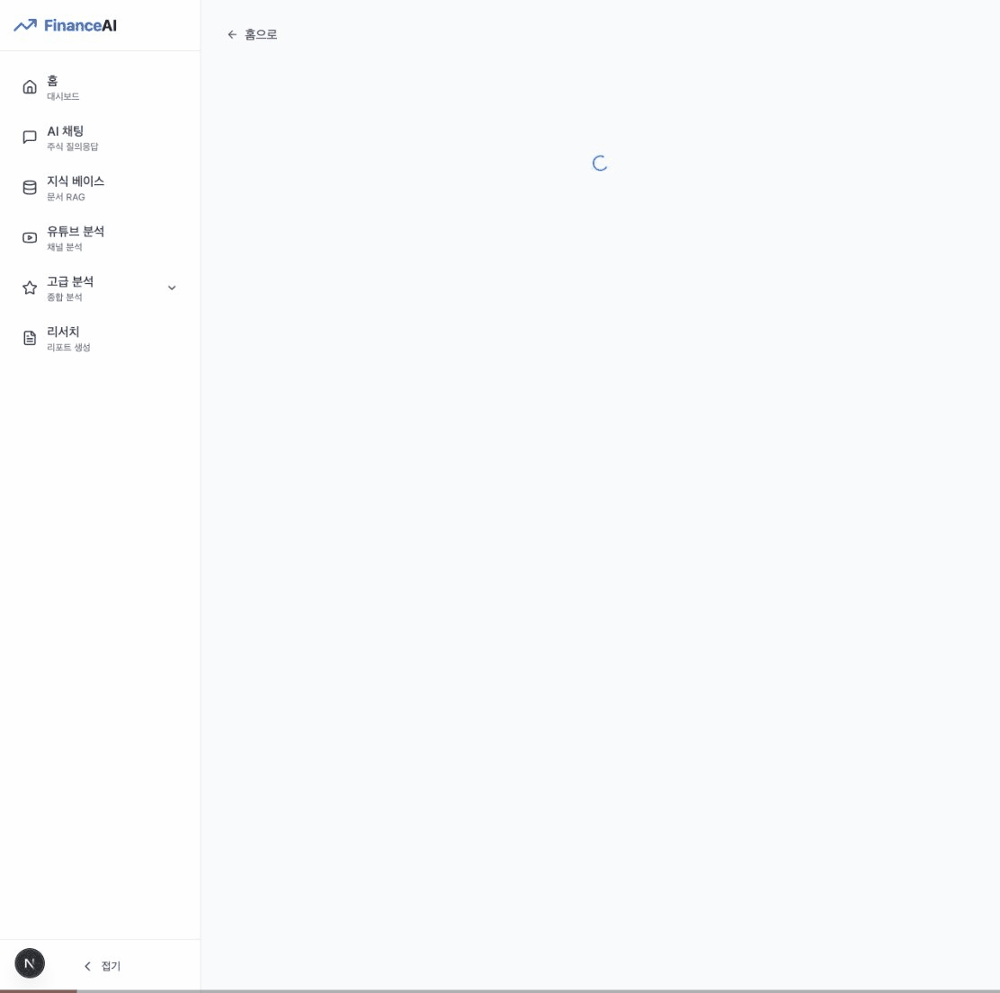

# FinanceAI

AI 기반 주식 분석 플랫폼 - 한국(KRX) 및 미국(NYSE/NASDAQ) 시장 지원

## 데모



## 주요 기능

- **주식 검색 및 차트** - 실시간 주가, 캔들차트, 기업 정보
- **기술적 분석** - 이동평균, RSI, MACD 등 기술 지표 + AI 해석
- **기본적 분석** - 재무제표, 밸류에이션, 재무비율 + AI 해석
- **AI 리서치** - 멀티 에이전트 기반 종합 투자 리포트 자동 생성
- **AI 채팅** - 자연어로 주식 정보 질의응답

## 기술 스택

- **Backend**: FastAPI, Python 3.10+
- **Frontend**: Next.js 15, React 19, TypeScript, Tailwind CSS
- **AI**: OpenAI GPT-4 (LangChain)
- **Data**: yfinance, pykrx, OpenDART

## 빠른 시작

```bash
# 저장소 클론
git clone https://github.com/mhb8436/FinanceAI.git
cd FinanceAI

# 환경 변수 설정
cp .env.example .env
# .env 파일에 LLM_API_KEY 등 설정

# 실행 (Docker)
docker compose up

# 또는 수동 실행
python scripts/start_web.py
```

- 프론트엔드: http://localhost:3000
- API 문서: http://localhost:8001/docs

## 문서

- [프로젝트 비전](docs/VISION.md)
- [통합 테스트 시나리오](docs/INTEGRATION_TEST_SCENARIO.md)

## 라이선스

MIT License
